# Semana 5: AWS 

Repo: https://github.com/hiiramsan/taskflow-aws-hiram

## AWS: fundamentos, EC2, S3, VPC y RDS

El objetivo de la practica es principalmente montar el artefacto `taskflow-api` en un servidor real, ya no solo en nuestra PC. 

### 1. Crear una EC2

Una **EC2** (Elastic Cloud Compute) es un servicio de AWS que permite crear y administrar servidores virtuales en la nube para ejecutar aplicaciones, servicios y procesos. Estos recursos son elasticos, es decir, puedes aumentar o reducir la capacidad de forma automatica segun la demanda. Ademas solo pagas por el tiempo y recursos que consumes.

Creamos una EC2 con estas especificaciones:

**name:** taskflow-ec2 \
**AMI:** Amazon Linux 2023 kernel-6.18 \
**Instance type:** t3.micro \
**Configure storage:** 8 GB, tipo General Purpose SSD (gp3)

Despues, creamos un key pair llamado `taskflow-key` de tipo RSA en formato .pem y lo guardamos en un lugar seguro, ya que será necesario para conectarnos a la instancia EC2 mediante SSH.

Además, configuramos el grupo de seguridad `taskflow-ec2-sg` de la instancia EC2 para permitir el tráfico entrante en los puertos necesarios, como el puerto 22 para SSH y el puerto 80 para HTTP. Esto asegura que podamos acceder a la instancia de manera segura y que nuestra aplicación web sea accesible desde internet.

### 2. Conectarse a la EC2 mediante SSH

Una vez la instancia EC2 fue creada vamos a observar su dirección IP pública en la consola de AWS, ya que la necesitaremos para conectarnos mediante SSH.

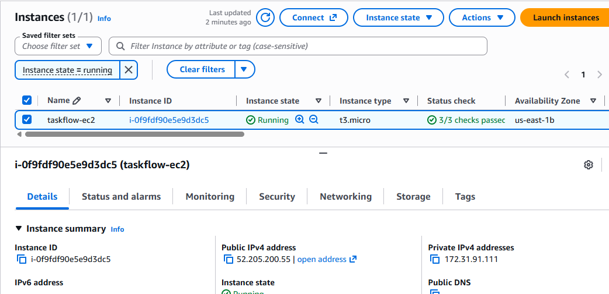

Para conectarnos a la instancia EC2, utilizamos el key pair `taskflow-key` que creamos anteriormente asi que nos ubicamos de preferencia en una folder llamada conexion que contiene la llave `taskflow-key.pem`. Ejecutamos el siguiente comando desde nuestra terminal:

```bash
chmod 400 taskflow-key.pem
ssh -i taskflow-key.pem ec2-user@<IP-DE-EC2>
```

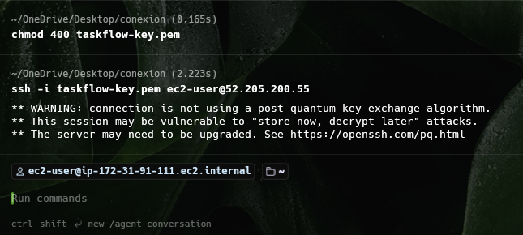

De esta forma ya estamos conectados a nuestra instancia EC2 mediante SSH y podemos comenzar a administrar el servidor y desplegar nuestra aplicación Taskflow.

### 3. Descargar Java en la EC2 y montar el jar

Dentro de nuestra instancia EC2, vamos a descargar e instalar Java, que es necesario para ejecutar nuestra aplicación Taskflow. Ejecutamos los siguientes comandos:

```bash
sudo dnf install -y java-21-amazon-corretto-headless
java -version
```

y teniendo el jar en la misma raiz que la pem, podemos subirla a la instancia con el sigueinte comando:

```bash
scp -i taskflow-key.pem taskflow-api-3.0.0.jar ec2-user@52.205.200.55:~/taskflow-api.jar
```

Despues para comprobar podemos ejecutar los siguintes comandos:

```bash
shasum -a 256 target/taskflow-api-*.jar   # en tu laptop
sha256sum ~/taskflow-api.jar              # en la EC2 (Amazon Linux no trae shasum)
```
los hashes deberian ser los mismos.

### 4. Ejecutar la aplicación Taskflow

Ahora, en la terminal de nuestra instancia EC2, ejecutamos el siguiente comando para iniciar la aplicación Taskflow:

```bash
nohup java -jar taskflow-api.jar > app.log 2>&1 &
tail -f app.log
```

con `nohup` (no hangup) estamos indicando que se mantenga la aplicación ejecutándose incluso si cerramos la sesión SSH. El comando `tail -f app.log` nos permite ver en tiempo real los registros de la aplicación para verificar que esté funcionando correctamente.

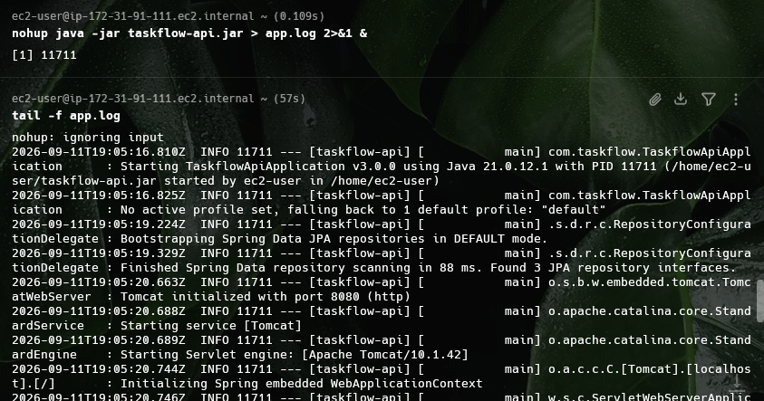

Y despues podemos entrar a `http://<TU-IP>:8080/swagger-ui/index.html` y verificar que la aplicación Taskflow esté funcionando correctamente.

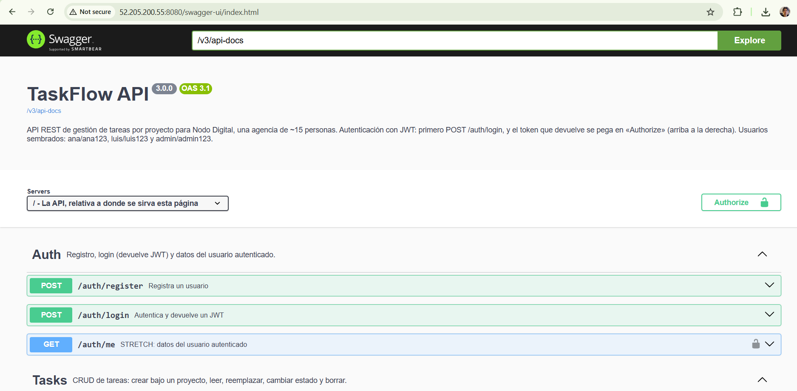

### 5. Creación de RDS

Ahora vamos a crear una base de datos en Amazon RDS que será utilizada por nuestra aplicación Taskflow.

**Amazon RDS** (Relational Database Service) es un servicio administrado que facilita la configuración, operación y escalado de bases de datos relacionales en la nube. Con RDS, podemos crear instancias de bases de datos como MySQL, PostgreSQL, MariaDB, Oracle y SQL Server de manera sencilla y con alta disponibilidad.

Navegamos a Aurora and RDS -> Databases -> Create database

Creamos una RDS con estas opciones:

**Engine option:** PostgreSQL \
**Database creation method:** Full configuration  
**Template:** Free tier  
**Instance class:** db.t3.micro
**Database identifier:** taskflow-db  
**Master username:** taskflow
**Credentials management:** Self managed
**Password:** <TU-PASSWORD>
**Storage:** 20 GB  
**VPC:** Create new → New VPC security group name: taskflow-rds-sg
**Subnet:** default  
**Public accessibility:** Yes \
**Initial database name:** taskflow 

Una vez creada la RDS, debemos tomar nota del endpoint de la base de datos, ya que lo necesitaremos para configurar nuestra aplicación Taskflow.

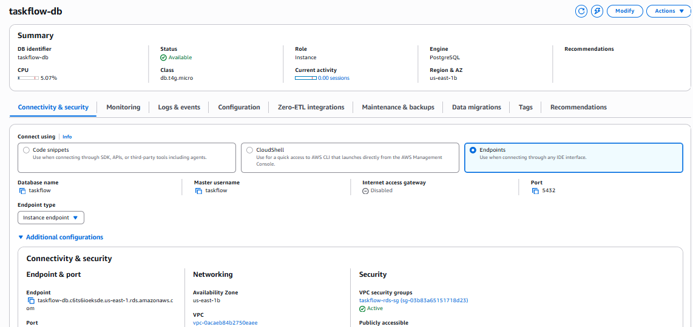

### 6. Conectar API a RDS

1. Generamos un secreto para JWT con 
```bash
openssl rand -hex 32  
```
2. Arrancamos RDS
```bash
nohup java -jar taskflow-api.jar \
  --spring.profiles.active=docker \
  --DB_HOST=taskflow-db.c6ts6ioeksde.us-east-1.rds.amazonaws.com --DB_PORT=5432 --DB_NAME=taskflow \
  --DB_USER=taskflow --DB_PASSWORD=taskflow \
  --JWT_SECRET=99a5ec098e7c501246e20fb060ca43852841c39d9f0ac4401be9636cb18de8b1 \
  > app.log 2>&1 &
```

Pero aun no va funcionar porque necesitamos permitir que nuestra instancia EC2 pueda conectarse a la base de datos RDS. Para ello, debemos configurar el grupo de seguridad de la RDS y agregar una regla de entrada que permita el tráfico desde la IP de nuestra instancia EC2 en el puerto 5432 (PostgreSQL).

EC2 → menú izquierdo, bloque Network & Security → Security Groups → pulsa taskflow-rds-sg (el que creó RDS) → pestaña Inbound rules → Edit inbound rules → Add rule:
- **Type:** PostgreSQL
- **Protocol:** TCP
- **Port range:** 5432
- **Source:** taskflow-ec2-sg...

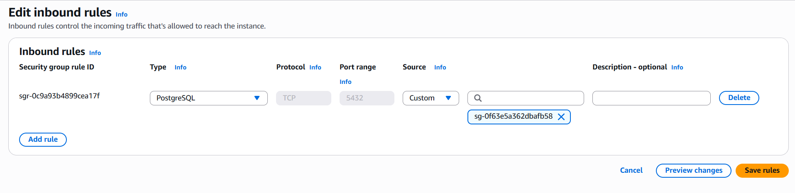

### Resumen

Hemos configurado nuestra base de datos RDS y conectado nuestra API a ella, asegurándonos de que la instancia EC2 tenga los permisos necesarios para acceder a la base de datos. Ahora nuestra aplicación Taskflow puede interactuar con la base de datos de manera segura y eficiente, para verificar podemos hacer un login de forma exitosa

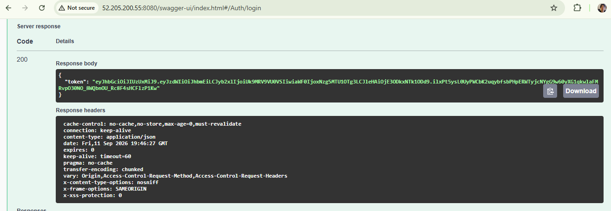


## AWS: DynamoDB, CodePipeline y CodeDeploy

El objetivo de esta práctica fue montar una pipeline CI/CD para el despliegue automatico de nuestra app Taskflow usando los servicios de AWS.

Servicios utilizados:

- EC2: Instancia que aloja nuestra aplicación Taskflow y se conecta a la base de datos RDS.
- DynamoDB: Base de datos NoSQL utilizada para almacenar logs de la aplicación.
- CodePipeline: Servicio de integración y entrega continua que automatiza el despliegue de la aplicación.
- CodeDeploy: Servicio que despliega automáticamente la aplicación en la instancia EC2.

### Lanzar nuevamente la EC2, ahora con rol de lectura en S3

Lanzamos una nueva instancia EC2 pero con dos diferencias sobre la pasada: un tag "taskflow-ec2" y un IAM instance profile

1. Navegamos a Barra de búsqueda → IAM → menú izquierdo Roles → Create role:
2. Seleccionamos "AWS service" y luego "EC2" como tipo de entidad que usará este rol.
3. Adjuntamos la política "AmazonS3ReadOnlyAccess" para otorgar permisos de lectura en S3.
4. Revisamos y creamos el rol, asignándole un nombre descriptivo como "taskflow-ec2-s3-role".
5. Asociamos este rol al instance profile que usaremos al lanzar la nueva instancia EC2.
6. Al crear la nueva ec2, le colocamos el IAM role que acabamos de crear. Al final obtendremos una instancia con permisos para leer la S3:

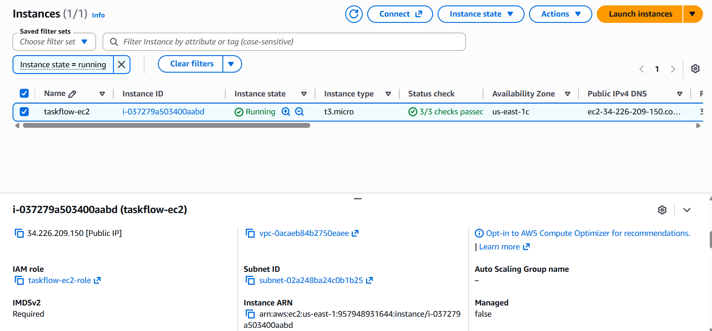

Para finalizar, volvemos a ingresar con ssh a la nueva instancia e instalamos java, esta vez en cambio no subiremos el jar ya que eso lo hara la pipeline.

### Instalacion de AWS CLI

Para seguir con la implementacion de DynamoDB en este paso necesitamos instalar y configurar la AWS CLI en nuestra instancia EC2. Esto nos permitirá interactuar con los servicios de AWS desde la línea de comandos.

```bash
aws configure
#  AWS Access Key ID:      la Access key
#  AWS Secret Access Key:  la Secret access key
#  Default region name:    us-east-1   (us-east-2 si tu cuenta es de la experiencia nueva)
#  Default output format:  json
aws configure set cli_pager ""  # sin esto, las respuestas largas se abren en un paginador y la terminal se queda con ":" abajo (se sale con q)
aws sts get-caller-identity     # debe devolver tu cuenta y arn:aws:iam::…:user/taskflow-admin
```

### Crear tabla en DymanoDB

Ahora utilizamos la AWS CLI para crear una tabla en DynamoDB 

```bash
aws dynamodb create-table \
  --table-name taskflow-eventos \
  --attribute-definitions \
      AttributeName=taskId,AttributeType=S \
      AttributeName=fechaHora,AttributeType=S \
  --key-schema \
      AttributeName=taskId,KeyType=TODO \
      AttributeName=fechaHora,KeyType=TODO \
  --billing-mode PAY_PER_REQUEST
  ```

  y en la consola podemos entrar a verificar que se ha creado.

  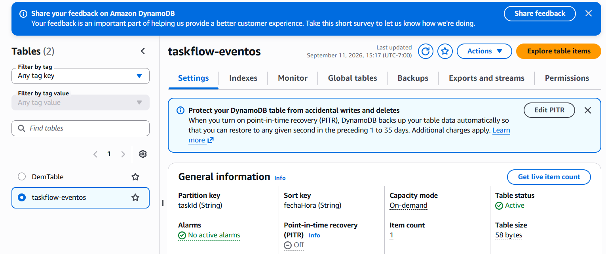

  Despues podemos insertar elementos en la tabla utilizando el comando `aws dynamodb put-item` o consultar los elementos con `aws dynamodb scan`. Por ejemplo:

  ```bash
aws dynamodb put-item --table-name taskflow-eventos --item '{"taskId":{"S":"T-001"},"fechaHora":{"S":"2026-09-08T09:15:00Z"},"tipo":{"S":"CREADA"},"autor":{"S":"ana"},"detalle":{"S":"Maquetar la pantalla de proyectos"}}'
  ```

  o consultar los elementos con:

  ```bash
aws dynamodb scan --table-name taskflow-eventos
  ```

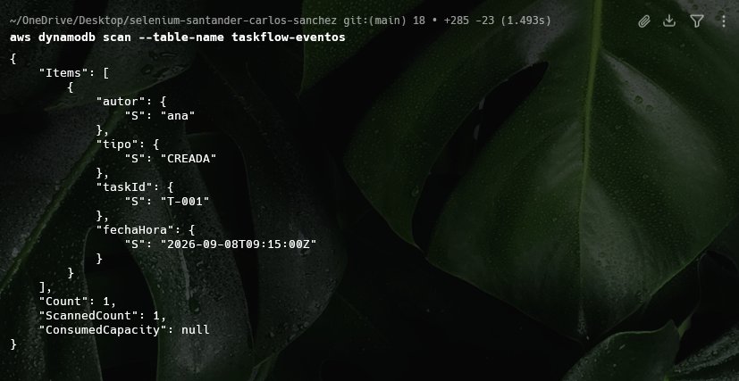

### Definición del Pipeline

El objetivo de este pipeline es automatizar la construccion y despliegue de la aplicación en nuestra infraestructura de AWS.

Servicios utilizados: 

**- CodePipeline:** Servicio de AWS que permite automatizar el flujo de trabajo de integración y entrega continua (CI/CD) para la aplicación.
- **CodeDeploy:** Servicio de AWS que automatiza el despliegue de aplicaciones en instancias EC2.
- **CodeBuild:** Servicio de AWS que compila el código fuente, ejecuta pruebas y produce artefactos listos para el despliegue.
- **S3:** Servicio de almacenamiento de objetos de AWS donde se suben los artefactos generados por CodeBuild para que posteriormente CodeDeploy los utilice.

Funciona de esta manera:

1. Cuando realizamos un cambio en nuestro proyecto y realizamos push a la rama principal, el pipeline se dispara automáticamente.
2. Github lo detecta y ejecuta las acciones definidas en el pipeline
3. CodeBuild compila el proyecto utilizando las instrucciones definidas en el archivo `buildspec.yml`. Empaqueta el proyecto en un artefacto listo para ser desplegado y arma el zip que posteriormente se sube a la S3. 
4. CodeDeploy toma el artefacto desde la S3 y lo despliega en la instancia EC2 según la configuración definida en la aplicación de despliegue.
5. El agente lee `appspec.yml` y realiza las acciones necesarias para completar el despliegue en la instancia EC2, entre ellas: 
  - Detener la aplicación en ejecución. (`parar.sh`)
  - Dar permisos necesarios a los archivos y directorios. (`permisos.sh`)
  - Arrancar la aplicación nuevamente. (`arrancar.sh`)
  - Verificar que la aplicación se esté ejecutando correctamente. (`verificar.sh`)

  Los anteriores pasos aseguran que la aplicación se despliegue correctamente en la instancia EC2 y que cualquier cambio realizado se refleje de manera inmediata.

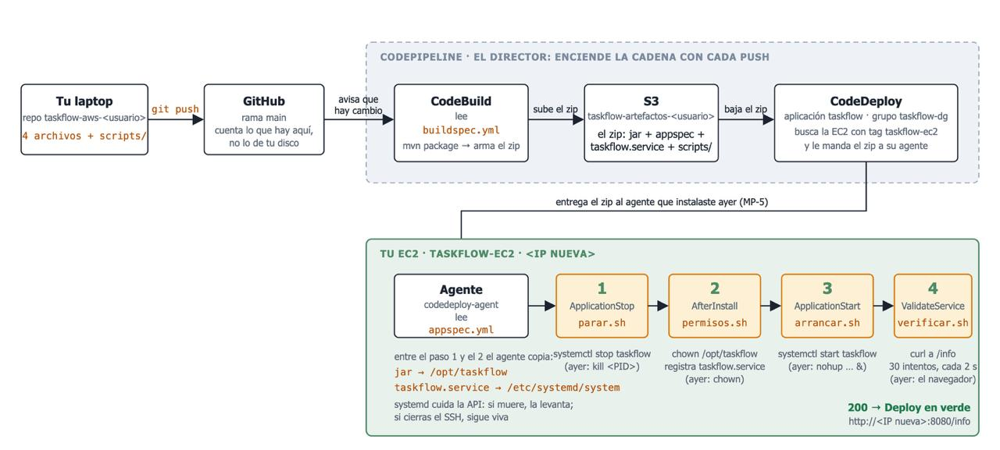

### Instalacion de agente CodeDeploy
  
  El agente de codedeploy tiene que vivir dentro de la instancia EC2 por lo que nos tenemos que conectar como anteriormente lo haciamos mediante ssh con el `.pem` y la ip donde vive la EC2

  Una vez conectados a la instancia EC2, podemos instalar el agente de CodeDeploy utilizando los siguientes comandos:

  ```bash
  sudo dnf install -y ruby wget
cd /home/ec2-user
REGION=us-east-1        # ← us-east-2 si tu cuenta es de la experiencia nueva (Ohio)
wget https://aws-codedeploy-$REGION.s3.$REGION.amazonaws.com/latest/install
head -1 install         # tiene que decir: #!/usr/bin/env ruby
chmod +x ./install
sudo ./install auto
sudo systemctl status codedeploy-agent
  ``` 

  Podemos verificar que el agente de CodeDeploy se esté ejecutando correctamente con el comando `sudo systemctl status codedeploy-agent`.

  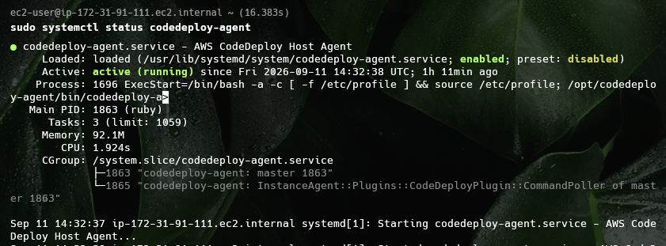

### Archivos necesarios

Para que CodeDeploy funcione correctamente, necesitamos los siguientes archivos en nuestro proyecto:

- `appspec.yml`: Define cómo se debe desplegar la aplicación en la instancia EC2.
 - `buildspec.yml`: Define las instrucciones para que CodeBuild compile el proyecto y genere los artefactos necesarios.
- `scripts/`: Directorio que contiene los scripts de despliegue (`parar.sh`, `permisos.sh`, `arrancar.sh`, `verificar.sh`).

### Ultimos pasos

Lo que resta es cablear el pipeline de CodePipeline con CodeDeploy para que los cambios en el repositorio se desplieguen automáticamente en la instancia EC2.


